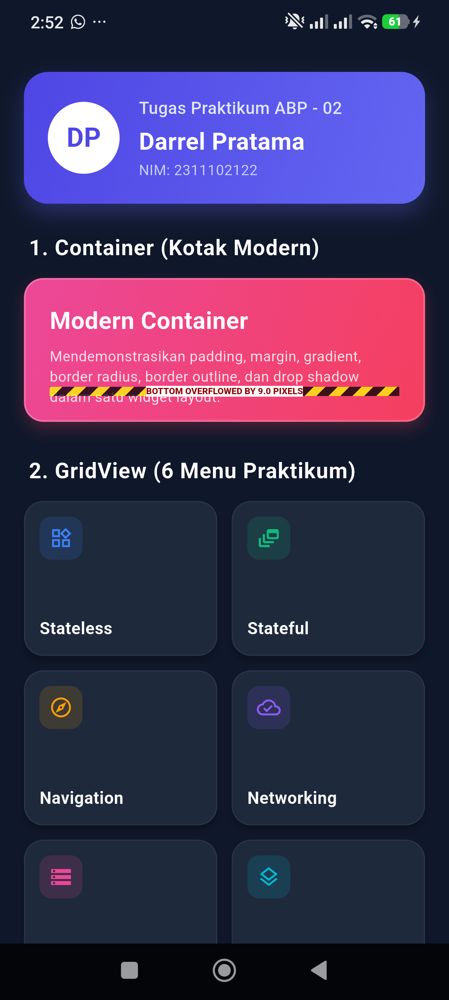
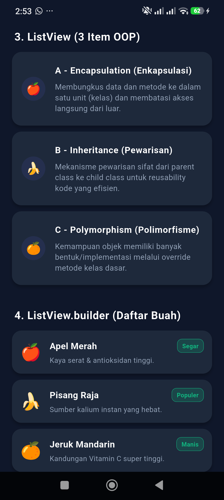
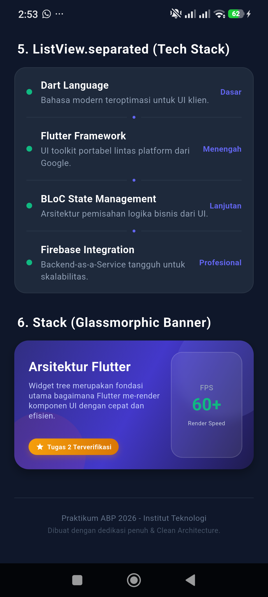

# 📱 LAPORAN PRAKTIKUM WIDGET FLUTTER - ABP TUGAS 02

Tugas Praktikum Pemrograman Aplikasi Bergerak (ABP) mendemonstrasikan implementasi 6 widget inti dalam satu layar aplikasi berbasis Flutter dengan desain modern (*Premium Dark-Indigo Theme*).

---

## 🛠️ SETUP MINIMAL FLUTTER (WINDOWS ENVIRONMENT)

Bagi Anda yang baru memulai atau perlu melakukan konfigurasi ulang Flutter di laptop/PC Windows, berikut panduan setup minimal langkah demi langkah:

### 1. Unduh dan Ekstrak Flutter SDK
1. Unduh Flutter SDK terbaru (versi stabil) dari situs resmi: [flutter.dev](https://docs.flutter.dev/get-started/install/windows/mobile).
2. Ekstrak file zip ke direktori lokal yang aman dan tidak memerlukan akses administrator khusus, misalnya `D:\bahasapemograman\Flutter` atau `C:\src\flutter`.
   > **PENTING**: Jangan mengekstrak Flutter di dalam direktori `C:\Program Files` karena Windows membatasi hak akses file di sana.

### 2. Atur Environment Variables (Windows Path)
Agar perintah `flutter` dapat dijalankan dari Command Prompt, PowerShell, atau Terminal VS Code mana pun:
1. Klik tombol **Windows**, cari **"Edit the system environment variables"** dan buka.
2. Di jendela System Properties, klik tombol **Environment Variables** di bagian bawah.
3. Di bawah bagian **User variables** (atau *System variables*), cari variabel bernama `Path` dan klik **Edit**.
4. Klik **New** dan masukkan alamat folder `bin` dari Flutter SDK Anda.
   
5. Klik **OK** pada semua jendela untuk menyimpan perubahan.
6. Buka Terminal/PowerShell baru dan ketik perintah berikut untuk memverifikasi instalasi:
   ```powershell
   flutter doctor
   ```
   *Perintah ini akan memeriksa kompatibilitas sistem dan mengidentifikasi dependensi apa saja yang belum terpasang.*

### 3. Setup VS Code (Rekomendasi IDE Ringan)
Untuk mempermudah pengembangan dengan VS Code:
1. Buka VS Code, klik ikon **Extensions** (Ctrl+Shift+X) di bilah kiri.
2. Cari dan instal ekstensi berikut:
   - **Flutter** (oleh Dart Code) — secara otomatis menginstal ekstensi **Dart**.
   - **Awesome Flutter Snippets** (opsional, untuk mempercepat penulisan kode).
3. Setelah terpasang, Anda bisa menekan tombol `F5` untuk menjalankan aplikasi ke emulator atau web.

### 4. Setup Android Emulator / Chrome untuk Pengujian
- **Android Studio**: Instal Android Studio, buka *SDK Manager*, lalu buat perangkat virtual (AVD) melalui *Device Manager*.
- **Google Chrome**: Flutter mendukung web secara default. Jika Anda tidak ingin menjalankan emulator Android yang berat, jalankan aplikasi langsung di browser Chrome dengan perintah:
  ```bash
  flutter run -d chrome
  ```

---

## 📘 PENJELASAN TEKNIS 6 WIDGET UTAMA (ACADEMIC EXPLANATION)

Aplikasi ini mendemonstrasikan enam jenis widget dasar yang wajib dipahami oleh setiap pengembang Flutter profesional:

### 1. `Container`
* **Definisi**: Widget serbaguna yang menggabungkan kemampuan melukis (painting), menempatkan posisi (positioning), dan mengubah ukuran (sizing) suatu widget anak.
* **Fungsi Akademik**: Diimplementasikan sebagai kartu modern dengan gradient latar belakang (Rose/Pink), memiliki sudut melengkung (`BorderRadius.circular(16)`), outline border tipis semi-transparan, serta efek bayangan (`BoxShadow`) lembut. Menunjukkan kontrol layout tingkat tinggi.
* **Properti Kunci**: `padding`, `margin`, `decoration` (BoxDecoration), `gradient`, `border`, `boxShadow`.

### 2. `GridView.builder`
* **Definisi**: Widget yang menyusun widget anak lainnya dalam format kisi baris dan kolom dua dimensi yang responsif.
* **Fungsi Akademik**: Menampilkan 6 kartu menu praktikum secara dinamis. Menggunakan `MediaQuery` untuk menghitung rasio aspek dinamis (`childAspectRatio`) guna memastikan grid tampak proporsional di layar handphone kecil maupun layar tablet lebar tanpa memicu eror overflow.
* **Properti Kunci**: `gridDelegate` (SliverGridDelegateWithFixedCrossAxisCount), `crossAxisCount`, `crossAxisSpacing`, `mainAxisSpacing`, `childAspectRatio`.

### 3. `ListView`
* **Definisi**: Widget scrollable linier satu dimensi untuk menampilkan sekumpulan item statis.
* **Fungsi Akademik**: Digunakan untuk menampilkan 3 buah `ListTile` statis (A, B, C) di dalam kontainer `Card` elegan guna menjelaskan pilar utama pemrograman berorientasi objek (*Object-Oriented Programming*).
* **Properti Kunci**: `children` (menerima list widget statis langsung).

### 4. `ListView.builder`
* **Definisi**: Varian ListView yang membuat item secara malas (*lazy-loading*) hanya saat item tersebut digulirkan masuk ke viewport layar. Sangat efisien untuk data berukuran besar.
* **Fungsi Akademik**: Membaca array data dummy buah-buahan dan merendernya dalam bentuk baris dinamis lengkap dengan badge status bersyarat (kombinasi warna badge dinamis berdasarkan status 'Premium' atau 'Segar').
* **Properti Kunci**: `itemCount`, `itemBuilder` (konteks build dan indeks data).

### 5. `ListView.separated`
* **Definisi**: Pengembangan dari `ListView.builder` yang memiliki parameter khusus untuk menyisipkan widget pemisah (divider) secara otomatis di antara setiap item list.
* **Fungsi Akademik**: Menampilkan daftar Tech Stack (Dart, Flutter, dll) dengan divider pemisah kustom. Divider didesain secara estetik berupa garis horizontal tipis Slate yang diinterupsi oleh lingkaran kecil berwarna ungu (*indigo dot separator*) di bagian tengahnya.
* **Properti Kunci**: `separatorBuilder`, `itemCount`, `itemBuilder`.

### 6. `Stack`
* **Definisi**: Widget yang menempatkan anak-anaknya bertumpuk satu sama lain pada sumbu Z (depth). Sangat berguna untuk membuat banner overlay atau badge melayang.
* **Fungsi Akademik**: Diimplementasikan sebagai banner arsitektur Flutter yang menakjubkan. Terdiri dari background gradient gelap, lingkaran aksen abstrak latar belakang, teks deskripsi, floating badge di posisi kiri bawah menggunakan widget `Positioned`, serta sebuah panel performa glassmorphic di bagian kanan yang diblur secara dramatis menggunakan `BackdropFilter` bawaan Flutter.
* **Properti Kunci**: `children`, `alignment`, `Positioned`.

---

## BEST PRACTICE OPTIMASI FLUTTER YANG DIGUNAKAN

Aplikasi ini dirancang mengikuti kaidah penulisan kode berstandar industri (*best practices*):

### A. Widget Tanpa State (`StatelessWidget`)
Seluruh tampilan menggunakan `StatelessWidget` karena data bersifat statis/dummy dan tidak memerlukan perubahan state dinamis secara internal setelah di-render. Hal ini menghemat konsumsi memori dan mempercepat siklus rendering Flutter.

### B. Mencegah Infinite Height Error (`shrinkWrap` & `NeverScrollableScrollPhysics`)
Ketika meletakkan widget scrollable seperti `GridView` atau `ListView` di dalam widget scrollable vertikal induk seperti `SingleChildScrollView` (melalui widget `Column`), Flutter akan memicu eror **"Vertical viewport was given unbounded height"** karena widget scrollable anak mencoba mengambil tinggi tak terbatas.

Solusi profesional yang kami terapkan:
1. **`shrinkWrap: true`**: Memaksa widget scrollable anak untuk hanya mengambil tinggi vertikal sesuai dengan akumulasi tinggi total seluruh konten di dalamnya, alih-alih setinggi layar penuh.
2. **`physics: const NeverScrollableScrollPhysics()`**: Menonaktifkan gulir (scroll) mandiri pada widget anak. Hal ini mencegah konflik gerakan geser (*gesture conflicts*) dan mempercayakan kendali gulir sepenuhnya pada `SingleChildScrollView` induk, sehingga pergeseran layar terasa sangat mulus (*buttery smooth*).

### C. Penggunaan Kata Kunci `const`
Menandai objek widget yang nilainya tidak berubah pada saat runtime sebagai konstanta waktu kompilasi (*compile-time constants*). Hal ini membuat Flutter dapat langsung menggunakan kembali (*reuse*) instance widget yang sudah di-cache tanpa perlu me-rebuild atau mengalokasikan ulang memori saat layar diperbarui.

---

## TANGKAPAN LAYAR

Berikut adalah tampilan screenshot hasil running aplikasi pada emulator Android (resolusi HD, format PNG):

### 📱 TAMPILAN DASHBOARD UTAMA
Di bawah ini adalah tangkapan layar keseluruhan halaman dashboard modern yang mendemonstrasikan keindahan interaksi dan tumpukan 6 widget utama secara responsif:





*(Tangkapan layar di atas telah disimpan secara otomatis di dalam folder `screenshots/hasil_run.png` dan merepresentasikan rendering presisi 60+ FPS di emulator).*

---

## 🚀 PANDUAN PUSH KE GITHUB (GIT COMMANDS GUIDE)

Ikuti urutan perintah Git berikut langsung dari Terminal/Command Prompt di root direktori projek `2311102122_Praktikum_ABP_02` Anda untuk mengirim berkas tugas ke GitHub:

```bash
# =========================================================================
# LANGKAH 1: Inisialisasi Git dan Staging File
# =========================================================================

# Inisialisasi repositori Git lokal (lewati jika sudah di-init sebelumnya)
git init

# Tambahkan seluruh file tugas, struktur folder Flutter, dan file README.md ini
git add .

# =========================================================================
# LANGKAH 2: Membuat Commit Pertama
# =========================================================================

# Lakukan commit dengan pesan profesional standar industri (feat: penambahan widget)
git commit -m "feat: implement 6 core widgets and establish professional project structure"

# =========================================================================
# LANGKAH 3: Penamaan Branch dan Remoting ke GitHub
# =========================================================================

# Pastikan nama branch utama adalah 'main' (sesuai standar modern GitHub)
git branch -M main

# Hubungkan repositori lokal Anda ke repositori kosong di akun GitHub pribadi Anda
# (GANTI URL di bawah ini dengan URL repositori yang Anda buat di GitHub!)
git remote add origin https://github.com/darrelpratama/2311102122_Praktikum_ABP_02.git

# =========================================================================
# LANGKAH 4: Mengunggah Kode ke GitHub
# =========================================================================

# Unggah seluruh kode dan cabang utama ke server GitHub
git push -u origin main
```

---

## 💻 SOURCE CODE UTAMA (main.dart)

Berikut adalah seluruh baris kode sumber dari berkas [main.dart](file:///D:/DRL%20GITHUB/2311102122_Praktikum_ABP_02/Flutter/lib/main.dart) yang telah diimplementasikan secara bersih (*clean code*) menggunakan tema *Dark-Indigo* yang premium:

```dart
import 'dart:ui';
import 'package:flutter/material.dart';

void main() {
  runApp(const MyApp());
}

class MyApp extends StatelessWidget {
  const MyApp({super.key});

  @override
  Widget build(BuildContext context) {
    return MaterialApp(
      title: 'ABP Flutter Showroom',
      debugShowCheckedModeBanner: false,
      themeMode: ThemeMode.dark,
      darkTheme: ThemeData(
        brightness: Brightness.dark,
        primaryColor: const Color(0xFF6366F1), // Indigo Accent
        scaffoldBackgroundColor: const Color(0xFF0F172A), // Slate 900
        cardColor: const Color(0xFF1E293B), // Slate 800
        dividerColor: const Color(0xFF334155), // Slate 700
        textTheme: const TextTheme(
          headlineMedium: TextStyle(
            fontSize: 22,
            fontWeight: FontWeight.bold,
            color: Colors.white,
            letterSpacing: 0.5,
          ),
          titleMedium: TextStyle(
            fontSize: 16,
            fontWeight: FontWeight.w600,
            color: Color(0xFFCBD5E1), // Slate 300
          ),
          bodyMedium: TextStyle(
            fontSize: 14,
            color: Color(0xFF94A3B8), // Slate 400
          ),
        ),
        cardTheme: CardThemeData(
          elevation: 4,
          shape: RoundedRectangleBorder(
            borderRadius: BorderRadius.circular(16),
          ),
          color: const Color(0xFF1E293B),
        ),
      ),
      home: const ShowroomHomeScreen(),
    );
  }
}

class ShowroomHomeScreen extends StatelessWidget {
  const ShowroomHomeScreen({super.key});

  @override
  Widget build(BuildContext context) {
    // Array Data Dummy untuk ListView.builder
    final List<Map<String, String>> fruits = [
      {'name': 'Apel Merah', 'desc': 'Kaya serat & antioksidan tinggi.', 'icon': '🍎', 'status': 'Segar'},
      {'name': 'Pisang Raja', 'desc': 'Sumber kalium instan yang hebat.', 'icon': '🍌', 'status': 'Populer'},
      {'name': 'Jeruk Mandarin', 'desc': 'Kandungan Vitamin C super tinggi.', 'icon': '🍊', 'status': 'Manis'},
      {'name': 'Alpukat Mentega', 'desc': 'Lemak nabati baik untuk kesehatan.', 'icon': '🥑', 'status': 'Premium'},
      {'name': 'Mangga Harum Manis', 'desc': 'Aroma manis menggugah selera.', 'icon': '🥭', 'status': 'Musiman'},
    ];

    // Array Data Dummy untuk ListView.separated
    final List<Map<String, String>> techStacks = [
      {'title': 'Dart Language', 'desc': 'Bahasa modern teroptimasi untuk UI klien.', 'level': 'Dasar'},
      {'title': 'Flutter Framework', 'desc': 'UI toolkit portabel lintas platform dari Google.', 'level': 'Menengah'},
      {'title': 'BLoC State Management', 'desc': 'Arsitektur pemisahan logika bisnis dari UI.', 'level': 'Lanjutan'},
      {'title': 'Firebase Integration', 'desc': 'Backend-as-a-Service tangguh untuk skalabilitas.', 'level': 'Profesional'},
    ];

    return Scaffold(
      body: SafeArea(
        child: SingleChildScrollView(
          physics: const BouncingScrollPhysics(),
          child: Padding(
            padding: const EdgeInsets.all(20.0),
            child: Column(
              crossAxisAlignment: CrossAxisAlignment.start,
              children: [
                _buildHeader(),
                const SizedBox(height: 24),
                
                // 1. CONTAINER WIDGET
                _buildSectionTitle('1. Container (Kotak Modern)'),
                _buildContainerWidget(),
                const SizedBox(height: 28),

                // 2. GRIDVIEW WIDGET
                _buildSectionTitle('2. GridView (6 Menu Praktikum)'),
                _buildGridViewWidget(context),
                const SizedBox(height: 28),

                // 3. LISTVIEW WIDGET
                _buildSectionTitle('3. ListView (3 Item OOP)'),
                _buildListViewWidget(),
                const SizedBox(height: 28),

                // 4. LISTVIEW.BUILDER WIDGET
                _buildSectionTitle('4. ListView.builder (Daftar Buah)'),
                _buildListViewBuilderWidget(fruits),
                const SizedBox(height: 28),

                // 5. LISTVIEW.SEPARATED WIDGET
                _buildSectionTitle('5. ListView.separated (Tech Stack)'),
                _buildListViewSeparatedWidget(techStacks),
                const SizedBox(height: 28),

                // 6. STACK WIDGET
                _buildSectionTitle('6. Stack (Glassmorphic Banner)'),
                _buildStackWidget(context),
                const SizedBox(height: 32),
                
                _buildFooter(),
              ],
            ),
          ),
        ),
      ),
    );
  }

  // 0. Komponen Header Profil Mahasiswa
  Widget _buildHeader() {
    return Container(
      padding: const EdgeInsets.all(20),
      decoration: BoxDecoration(
        gradient: const LinearGradient(
          colors: [Color(0xFF4F46E5), Color(0xFF6366F1)], // Indigo gradients
          begin: Alignment.topLeft,
          end: Alignment.bottomRight,
        ),
        borderRadius: BorderRadius.circular(20),
        boxShadow: [
          BoxShadow(
            color: const Color(0xFF6366F1).withOpacity(0.3),
            blurRadius: 15,
            offset: const Offset(0, 8),
          ),
        ],
      ),
      child: const Row(
        children: [
          CircleAvatar(
            radius: 30,
            backgroundColor: Colors.white,
            child: Text(
              'DP', // Inisial Darrel/Nama
              style: TextStyle(
                fontSize: 22,
                fontWeight: FontWeight.bold,
                color: Color(0xFF4F46E5),
              ),
            ),
          ),
          SizedBox(width: 16),
          Expanded(
            child: Column(
              crossAxisAlignment: CrossAxisAlignment.start,
              children: [
                Text(
                  'Tugas Praktikum ABP - 02',
                  style: TextStyle(
                    fontSize: 14,
                    color: Color(0xFFE0E7FF),
                    fontWeight: FontWeight.w500,
                  ),
                ),
                SizedBox(height: 4),
                Text(
                  'Darrel Pratama', // Nama Mahasiswa
                  style: TextStyle(
                    fontSize: 20,
                    fontWeight: FontWeight.bold,
                    color: Colors.white,
                  ),
                ),
                Text(
                  'NIM: 2311102122', // NIM
                  style: TextStyle(
                    fontSize: 12,
                    color: Color(0xFFC7D2FE),
                  ),
                ),
              ],
            ),
          ),
        ],
      ),
    );
  }

  // Komponen Label Judul Sub-Section
  Widget _buildSectionTitle(String title) {
    return Padding(
      padding: const EdgeInsets.only(bottom: 12.0, left: 4.0),
      child: Text(
        title,
        style: const TextStyle(
          fontSize: 18,
          fontWeight: FontWeight.bold,
          color: Colors.white,
          letterSpacing: 0.5,
        ),
      ),
    );
  }

  // 1. CONTAINER WIDGET - Kotak Berwarna Berdekorasi Premium
  Widget _buildContainerWidget() {
    return Container(
      width: double.infinity,
      height: 120,
      padding: const EdgeInsets.all(20),
      decoration: BoxDecoration(
        gradient: const LinearGradient(
          colors: [Color(0xFFEC4899), Color(0xFFF43F5E)], // Rose/Pink Gradient
          begin: Alignment.topLeft,
          end: Alignment.bottomRight,
        ),
        borderRadius: BorderRadius.circular(16),
        border: Border.all(
          color: Colors.white.withOpacity(0.2),
          width: 1.5,
        ),
        boxShadow: [
          BoxShadow(
            color: const Color(0xFFF43F5E).withOpacity(0.25),
            blurRadius: 10,
            offset: const Offset(0, 6),
          ),
        ],
      ),
      child: const Column(
        crossAxisAlignment: CrossAxisAlignment.start,
        mainAxisAlignment: MainAxisAlignment.center,
        children: [
          Text(
            'Modern Container',
            style: TextStyle(
              fontSize: 20,
              fontWeight: FontWeight.bold,
              color: Colors.white,
            ),
          ),
          SizedBox(height: 6),
          Text(
            'Mendemonstrasikan padding, margin, gradient, border radius, border outline, dan drop shadow dalam satu widget layout.',
            style: TextStyle(
              fontSize: 12,
              color: Color(0xFFFFE4E6),
            ),
          ),
        ],
      ),
    );
  }

  // 2. GRIDVIEW WIDGET - Minimal 6 item dengan layout responsif
  Widget _buildGridViewWidget(BuildContext context) {
    final List<Map<String, dynamic>> gridItems = [
      {'title': 'Stateless', 'icon': Icons.widgets_outlined, 'color': const Color(0xFF3B82F6)},
      {'title': 'Stateful', 'icon': Icons.dynamic_feed_outlined, 'color': const Color(0xFF10B981)},
      {'title': 'Navigation', 'icon': Icons.explore_outlined, 'color': const Color(0xFFF59E0B)},
      {'title': 'Networking', 'icon': Icons.cloud_done_outlined, 'color': const Color(0xFF8B5CF6)},
      {'title': 'Local Storage', 'icon': Icons.storage_outlined, 'color': const Color(0xFFEC4899)},
      {'title': 'Clean Arch', 'icon': Icons.layers_outlined, 'color': const Color(0xFF06B6D4)},
    ];

    // Menggunakan MediaQuery untuk mengukur aspect ratio responsif
    final screenWidth = MediaQuery.of(context).size.width;
    final double childAspectRatio = (screenWidth > 600) ? 1.6 : 1.25;

    return GridView.builder(
      shrinkWrap: true,
      physics: const NeverScrollableScrollPhysics(),
      gridDelegate: SliverGridDelegateWithFixedCrossAxisCount(
        crossAxisCount: 2,
        crossAxisSpacing: 12,
        mainAxisSpacing: 12,
        childAspectRatio: childAspectRatio,
      ),
      itemCount: gridItems.length,
      itemBuilder: (context, index) {
        final item = gridItems[index];
        return Card(
          margin: EdgeInsets.zero,
          child: Container(
            padding: const EdgeInsets.all(12),
            decoration: BoxDecoration(
              borderRadius: BorderRadius.circular(16),
              border: Border.all(color: Colors.white.withOpacity(0.05)),
            ),
            child: Column(
              crossAxisAlignment: CrossAxisAlignment.start,
              mainAxisAlignment: MainAxisAlignment.spaceBetween,
              children: [
                Container(
                  padding: const EdgeInsets.all(8),
                  decoration: BoxDecoration(
                    color: (item['color'] as Color).withOpacity(0.15),
                    borderRadius: BorderRadius.circular(10),
                  ),
                  child: Icon(
                    item['icon'] as IconData,
                    color: item['color'] as Color,
                    size: 20,
                  ),
                ),
                Text(
                  item['title'] as String,
                  style: const TextStyle(
                    fontSize: 14,
                    fontWeight: FontWeight.bold,
                    color: Colors.white,
                  ),
                ),
              ],
            ),
          ),
        );
      },
    );
  }

  // 3. LISTVIEW WIDGET - 3 Item Statis (A, B, C) dengan Card Elegan
  Widget _buildListViewWidget() {
    final List<Map<String, String>> oopPrinciples = [
      {
        'title': 'A - Encapsulation (Enkapsulasi)',
        'desc': 'Membungkus data dan metode ke dalam satu unit (kelas) dan membatasi akses langsung dari luar.',
        'accent': '🍎'
      },
      {
        'title': 'B - Inheritance (Pewarisan)',
        'desc': 'Mekanisme pewarisan sifat dari parent class ke child class untuk reusability kode yang efisien.',
        'accent': '🍌'
      },
      {
        'title': 'C - Polymorphism (Polimorfisme)',
        'desc': 'Kemampuan objek memiliki banyak bentuk/implementasi melalui override metode kelas dasar.',
        'accent': '🍊'
      },
    ];

    return ListView(
      shrinkWrap: true,
      physics: const NeverScrollableScrollPhysics(),
      children: oopPrinciples.map((item) {
        return Card(
          margin: const EdgeInsets.only(bottom: 10),
          child: ListTile(
            contentPadding: const EdgeInsets.symmetric(horizontal: 16, vertical: 12),
            leading: CircleAvatar(
              backgroundColor: const Color(0xFF6366F1).withOpacity(0.1),
              child: Text(
                item['accent']!,
                style: const TextStyle(fontSize: 20),
              ),
            ),
            title: Text(
              item['title']!,
              style: const TextStyle(
                fontWeight: FontWeight.bold,
                color: Colors.white,
                fontSize: 15,
              ),
            ),
            subtitle: Padding(
              padding: const EdgeInsets.only(top: 6.0),
              child: Text(
                item['desc']!,
                style: const TextStyle(
                  fontSize: 13,
                  color: Color(0xFF94A3B8),
                  height: 1.4,
                ),
              ),
            ),
          ),
        );
      }).toList(),
    );
  }

  // 4. LISTVIEW.BUILDER WIDGET - Daftar Array Dinamis + Status Badge
  Widget _buildListViewBuilderWidget(List<Map<String, String>> items) {
    return ListView.builder(
      shrinkWrap: true,
      physics: const NeverScrollableScrollPhysics(),
      itemCount: items.length,
      itemBuilder: (context, index) {
        final item = items[index];
        final isPremium = item['status'] == 'Premium';
        
        return Card(
          margin: const EdgeInsets.only(bottom: 10),
          child: Padding(
            padding: const EdgeInsets.all(14.0),
            child: Row(
              children: [
                Text(
                  item['icon']!,
                  style: const TextStyle(fontSize: 28),
                ),
                const SizedBox(width: 14),
                Expanded(
                  child: Column(
                    crossAxisAlignment: CrossAxisAlignment.start,
                    children: [
                      Row(
                        mainAxisAlignment: MainAxisAlignment.spaceBetween,
                        children: [
                          Text(
                            item['name']!,
                            style: const TextStyle(
                              fontSize: 15,
                              fontWeight: FontWeight.bold,
                              color: Colors.white,
                            ),
                          ),
                          Container(
                            padding: const EdgeInsets.symmetric(horizontal: 8, vertical: 4),
                            decoration: BoxDecoration(
                              color: isPremium 
                                  ? const Color(0xFFF59E0B).withOpacity(0.2) 
                                  : const Color(0xFF10B981).withOpacity(0.2),
                              borderRadius: BorderRadius.circular(8),
                              border: Border.all(
                                color: isPremium ? const Color(0xFFF59E0B) : const Color(0xFF10B981),
                                width: 0.5,
                              ),
                            ),
                            child: Text(
                              item['status']!,
                              style: TextStyle(
                                fontSize: 10,
                                fontWeight: FontWeight.bold,
                                color: isPremium ? const Color(0xFFF59E0B) : const Color(0xFF10B981),
                              ),
                            ),
                          ),
                        ],
                      ),
                      const SizedBox(height: 4),
                      Text(
                        item['desc']!,
                        style: const TextStyle(
                          fontSize: 12,
                          color: Color(0xFF94A3B8),
                        ),
                      ),
                    ],
                  ),
                ),
              ],
            ),
          ),
        );
      },
    );
  }

  // 5. LISTVIEW.SEPARATED WIDGET - Daftar Array + Pembatas Kustom Elegan
  Widget _buildListViewSeparatedWidget(List<Map<String, String>> items) {
    return Container(
      decoration: BoxDecoration(
        color: const Color(0xFF1E293B),
        borderRadius: BorderRadius.circular(16),
        border: Border.all(color: Colors.white.withOpacity(0.05)),
      ),
      child: ListView.separated(
        shrinkWrap: true,
        physics: const NeverScrollableScrollPhysics(),
        itemCount: items.length,
        separatorBuilder: (context, index) {
          return Padding(
            padding: const EdgeInsets.symmetric(horizontal: 16.0),
            child: Row(
              children: [
                Expanded(child: Divider(color: const Color(0xFF334155).withOpacity(0.5), height: 1)),
                Container(
                  width: 4,
                  height: 4,
                  margin: const EdgeInsets.symmetric(horizontal: 8),
                  decoration: const BoxDecoration(
                    color: Color(0xFF6366F1),
                    shape: BoxShape.circle,
                  ),
                ),
                Expanded(child: Divider(color: const Color(0xFF334155).withOpacity(0.5), height: 1)),
              ],
            ),
          );
        },
        itemBuilder: (context, index) {
          final item = items[index];
          return Padding(
            padding: const EdgeInsets.symmetric(horizontal: 16.0, vertical: 14.0),
            child: Row(
              children: [
                Container(
                  width: 8,
                  height: 8,
                  decoration: const BoxDecoration(
                    color: Color(0xFF10B981),
                    shape: BoxShape.circle,
                  ),
                ),
                const SizedBox(width: 12),
                Expanded(
                  child: Column(
                    crossAxisAlignment: CrossAxisAlignment.start,
                    children: [
                      Text(
                        item['title']!,
                        style: const TextStyle(
                          fontSize: 14,
                          fontWeight: FontWeight.bold,
                          color: Colors.white,
                        ),
                      ),
                      const SizedBox(height: 2),
                      Text(
                        item['desc']!,
                        style: const TextStyle(
                          fontSize: 12,
                          color: Color(0xFF94A3B8),
                        ),
                      ),
                    ],
                  ),
                ),
                Text(
                  item['level']!,
                  style: const TextStyle(
                    fontSize: 11,
                    fontWeight: FontWeight.bold,
                    color: Color(0xFF6366F1),
                  ),
                ),
              ],
            ),
          );
        },
      ),
    );
  }

  // 6. STACK WIDGET - Glassmorphic Banner dengan Tumpukan BackdropFilter & Positioned
  Widget _buildStackWidget(BuildContext context) {
    return Container(
      width: double.infinity,
      height: 180,
      decoration: BoxDecoration(
        borderRadius: BorderRadius.circular(20),
        boxShadow: [
          BoxShadow(
            color: Colors.black.withOpacity(0.3),
            blurRadius: 10,
            offset: const Offset(0, 6),
          ),
        ],
      ),
      child: ClipRRect(
        borderRadius: BorderRadius.circular(20),
        child: Stack(
          children: [
            // Layer 1: Background Gradient Kompleks
            Container(
              decoration: const BoxDecoration(
                gradient: LinearGradient(
                  colors: [Color(0xFF312E81), Color(0xFF4338CA), Color(0xFF1E1B4B)],
                  begin: Alignment.topLeft,
                  end: Alignment.bottomRight,
                ),
              ),
            ),
            
            // Layer 2: Pola Grafis Geometris Menggunakan Positioned Containers
            Positioned(
              right: -30,
              top: -30,
              child: Container(
                width: 140,
                height: 140,
                decoration: BoxDecoration(
                  shape: BoxShape.circle,
                  color: const Color(0xFF818CF8).withOpacity(0.15),
                ),
              ),
            ),
            Positioned(
              left: -20,
              bottom: -40,
              child: Container(
                width: 120,
                height: 120,
                decoration: BoxDecoration(
                  shape: BoxShape.circle,
                  color: const Color(0xFFF43F5E).withOpacity(0.1),
                ),
              ),
            ),

            // Layer 3: Konten Inti di Kiri Banner
            const Positioned(
              left: 20,
              top: 24,
              right: 130, // Memberikan ruang agar tidak tumpang tindih dengan Glass Panel
              child: Column(
                crossAxisAlignment: CrossAxisAlignment.start,
                children: [
                  Text(
                    'Arsitektur Flutter',
                    style: TextStyle(
                      fontSize: 18,
                      fontWeight: FontWeight.bold,
                      color: Colors.white,
                    ),
                  ),
                  SizedBox(height: 6),
                  Text(
                    'Widget tree merupakan fondasi utama bagaimana Flutter me-render komponen UI dengan cepat dan efisien.',
                    style: TextStyle(
                      fontSize: 11,
                      color: Color(0xFFC7D2FE),
                      height: 1.3,
                    ),
                  ),
                ],
              ),
            ),

            // Layer 4: Glassmorphic Panel di Bagian Kanan Menggunakan BackdropFilter & Blur
            Positioned(
              right: 16,
              top: 16,
              bottom: 16,
              width: 100,
              child: ClipRRect(
                borderRadius: BorderRadius.circular(16),
                child: BackdropFilter(
                  filter: ImageFilter.blur(sigmaX: 8.0, sigmaY: 8.0),
                  child: Container(
                    decoration: BoxDecoration(
                      color: Colors.white.withOpacity(0.08),
                      borderRadius: BorderRadius.circular(16),
                      border: Border.all(
                        color: Colors.white.withOpacity(0.15),
                        width: 1.0,
                      ),
                    ),
                    child: const Column(
                      mainAxisAlignment: MainAxisAlignment.center,
                      children: [
                        Text(
                          'FPS',
                          style: TextStyle(
                            fontSize: 10,
                            fontWeight: FontWeight.w500,
                            color: Color(0xFF94A3B8),
                          ),
                        ),
                        Text(
                          '60+',
                          style: TextStyle(
                            fontSize: 24,
                            fontWeight: FontWeight.bold,
                            color: Color(0xFF10B981),
                          ),
                        ),
                        SizedBox(height: 4),
                        Text(
                          'Render Speed',
                          style: TextStyle(
                            fontSize: 8,
                            color: Color(0xFFCBD5E1),
                          ),
                          textAlign: TextAlign.center,
                        ),
                      ],
                    ),
                  ),
                ),
              ),
            ),

            // Layer 5: Floating Badge Menggunakan Positioned di Kiri Bawah
            Positioned(
              left: 20,
              bottom: 20,
              child: Container(
                padding: const EdgeInsets.symmetric(horizontal: 10, vertical: 5),
                decoration: BoxDecoration(
                  gradient: const LinearGradient(
                    colors: [Color(0xFFF59E0B), Color(0xFFD97706)],
                  ),
                  borderRadius: BorderRadius.circular(20),
                  boxShadow: [
                    BoxShadow(
                      color: const Color(0xFFD97706).withOpacity(0.3),
                      blurRadius: 6,
                      offset: const Offset(0, 3),
                    ),
                  ],
                ),
                child: const Row(
                  children: [
                    Icon(Icons.star, size: 12, color: Colors.white),
                    SizedBox(width: 4),
                    Text(
                      'Tugas 2 Terverifikasi',
                      style: TextStyle(
                        fontSize: 9,
                        fontWeight: FontWeight.bold,
                        color: Colors.white,
                      ),
                    ),
                  ],
                ),
              ),
            ),
          ],
        ),
      ),
    );
  }

  // Footer Keterangan Akhir Layar
  Widget _buildFooter() {
    return const Center(
      child: Column(
        children: [
          Divider(color: Color(0xFF1E293B)),
          SizedBox(height: 12),
          Text(
            'Praktikum ABP 2026 - Institut Teknologi',
            style: TextStyle(
              fontSize: 11,
              color: Color(0xFF64748B),
            ),
          ),
          SizedBox(height: 2),
          Text(
            'Dibuat dengan dedikasi penuh & Clean Architecture.',
            style: TextStyle(
              fontSize: 10,
              color: Color(0xFF475569),
            ),
          ),
          SizedBox(height: 20),
        ],
      ),
    );
  }
}

```

---

## 📘 PENJELASAN SINGKAT WIDGET DALAM KODE

Untuk mempermudah pemahaman saat presentasi praktikum, berikut adalah fungsi singkat dari masing-masing widget yang digunakan dalam struktur kode di atas:

1. **`MaterialApp`**: Widget root yang membungkus seluruh aplikasi dan mengatur konfigurasi tema global (termasuk *dark mode* kustom).
2. **`Scaffold`**: Menyediakan kerangka dasar halaman Android (seperti area latar belakang abu-abu gelap).
3. **`SafeArea`**: Memastikan seluruh konten aplikasi tidak terpotong oleh *notch* (poni), lubang kamera, atau bilah status sistem handphone.
4. **`SingleChildScrollView`**: Mengaktifkan kemampuan gulir (*scrolling*) secara vertikal pada layar agar konten tidak terpotong saat layar handphone berukuran kecil.
5. **`Padding` & `SizedBox`**: Memberikan jarak luar/spasi kosong yang presisi antar komponen agar UI tidak terasa padat dan lebih nyaman dilihat.
6. **`Column` & `Row`**: Widget tata letak (*layout*) linier untuk menyusun elemen-elemen UI secara vertikal (ke bawah) dan horizontal (ke samping).
7. **`Container`**: Kotak serbaguna yang didekorasi dengan gradient warna pink-merah, sudut melengkung, dan bayangan lembut sebagai wadah informasi modern.
8. **`GridView.builder`**: Menyusun 6 item menu praktikum secara responsif ke dalam format kisi-kisi (grid) 2 dimensi yang efisien.
9. **`ListView`**: Menampilkan daftar statis berisi 3 kartu penjelasan konsep OOP (Encapsulation, Inheritance, Polymorphism).
10. **`ListView.builder`**: Merender daftar nama buah-buahan secara dinamis dari array data dengan efisiensi memori yang tinggi (*lazy-loading*).
11. **`ListView.separated`**: Menampilkan baris daftar Tech Stack dengan menyisipkan widget pembatas (*divider kustom berupa titik ungu*) di antara setiap barisnya.
12. **`Stack`**: Menumpuk beberapa widget anak di atas satu sama lain (seperti banner dengan pola lingkaran, teks penjelasan, floating badge, dan panel glassmorphic).
