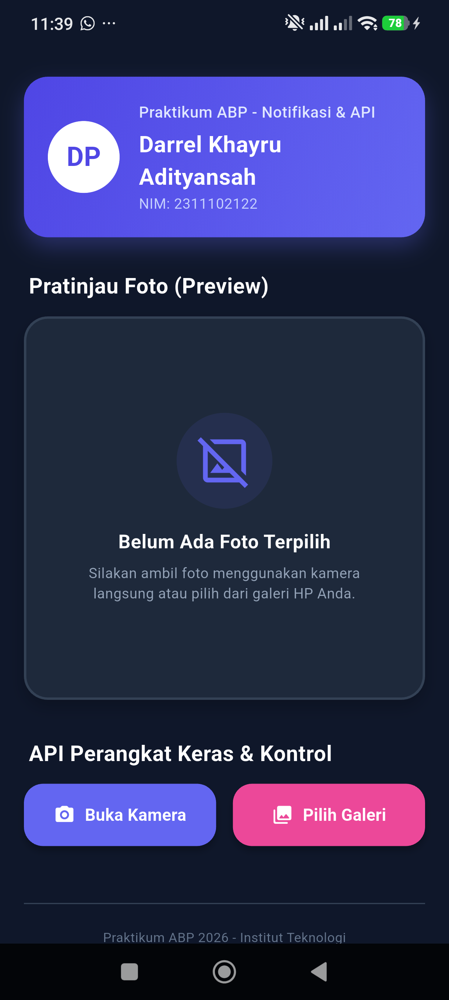
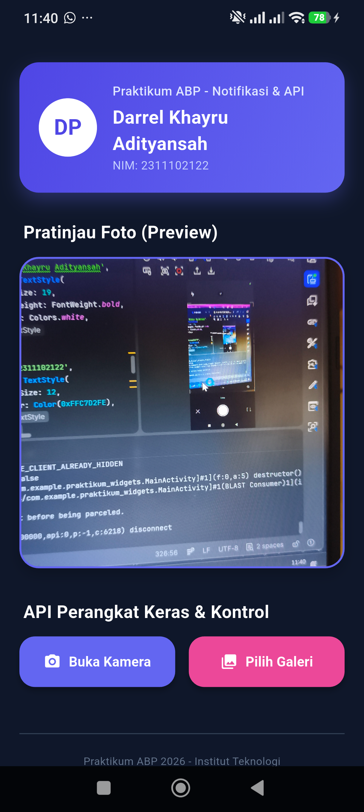
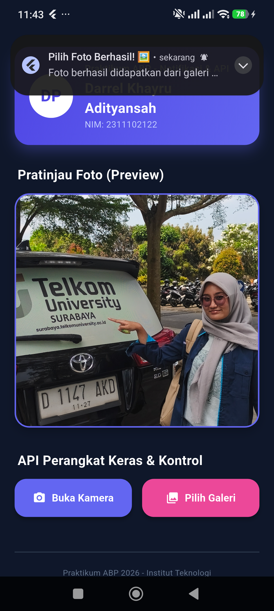

# Tugas Praktikum ABP - Notifikasi & API Perangkat Keras

Repositori ini berisi implementasi aplikasi Flutter sederhana yang mendemonstrasikan integrasi API perangkat keras (Kamera & Galeri) serta sistem Notifikasi Lokal pada HP Android fisik.

---

##  Fitur Utama

1. **Ambil Foto Langsung (Kamera)**
   * Membuka kamera bawaan perangkat fisik menggunakan package `image_picker` (`ImageSource.camera`).
   * Menampilkan hasil foto langsung di dalam area pratinjau (preview container) di layar.
   * Menembakkan notifikasi lokal ke system tray perangkat sebagai konfirmasi sukses pengambilan gambar.

2. **Pilih Foto dari Galeri**
   * Mengakses galeri/penyimpanan media internal HP fisik menggunakan package `image_picker` (`ImageSource.gallery`).
   * Memperbarui antarmuka secara dinamis dengan gambar terpilih.
   * Menembakkan notifikasi lokal ke system tray perangkat sebagai konfirmasi sukses pemilihan gambar.

3. **Notifikasi Lokal (`flutter_local_notifications`)**
   * Menampilkan pemberitahuan/notifikasi sistem di system tray/notification bar laci Android dengan prioritas tinggi (`Importance.max`), getaran, dan pemutaran suara default.
   * Masing-masing notifikasi diberi ID acak sehingga dapat menumpuk secara berurutan dan tidak menimpa satu sama lain.

4. **Manajemen Izin Dinamis (`permission_handler`)**
   * Memeriksa dan meminta hak akses Kamera, Galeri, dan Notifikasi (khusus Android 13+) sebelum menjalankan fungsionalitas terkait.
   * Menyediakan dialog edukatif kustom jika pengguna menolak memberikan izin, lengkap dengan tautan otomatis ke menu pengaturan sistem aplikasi (`openAppSettings()`) untuk mencegah aplikasi macet.

---

## Konfigurasi Android (HP Android Fisik)

### 1. File `AndroidManifest.xml`
Izin berikut telah dideklarasikan untuk menjamin kelancaran fungsionalitas perangkat keras dan notifikasi:
```xml
<!-- Izin menggunakan kamera fisik -->
<uses-permission android:name="android.permission.CAMERA" />

<!-- Izin akses media/galeri untuk OS Android 12 ke bawah -->
<uses-permission android:name="android.permission.READ_EXTERNAL_STORAGE" android:maxSdkVersion="32" />
<uses-permission android:name="android.permission.WRITE_EXTERNAL_STORAGE" android:maxSdkVersion="29" />

<!-- Izin akses media/galeri untuk OS Android 13 ke atas -->
<uses-permission android:name="android.permission.READ_MEDIA_IMAGES" />

<!-- Izin menampilkan notifikasi lokal untuk OS Android 13 ke atas -->
<uses-permission android:name="android.permission.POST_NOTIFICATIONS" />
```

### 2. File `build.gradle.kts` (Level App)
Menyesuaikan konfigurasi minimum SDK untuk memastikan kompatibilitas penuh dengan plugin:
```kotlin
defaultConfig {
    applicationId = "com.example.praktikum_widgets"
    minSdk = 21 // Kompatibel dengan flutter_local_notifications & permission_handler
    targetSdk = 34
}
```

---

## Petunjuk Pengujian Perangkat Fisik

1. Hubungkan HP Android Anda ke komputer/laptop menggunakan kabel data USB yang baik.
2. Pastikan opsi **USB Debugging** (Debugging USB) pada menu Opsi Pengembang HP Anda telah diaktifkan.
3. Jalankan perintah berikut pada direktori project untuk mengunduh package:
   ```bash
   flutter pub get
   ```
4. Jalankan aplikasi ke HP fisik Anda:
   ```bash
   flutter run
   ```
5. Berikan izin saat sistem operasi Android memunculkan pop-up permintaan akses kamera, penyimpanan, dan notifikasi.

### Screenshot

#### 1. Tampilan Awal


#### 2. Tampilan Setelah Mengambil Foto dari Kamera


#### 3. Tampilan Setelah Memilih Foto dari Galeri
