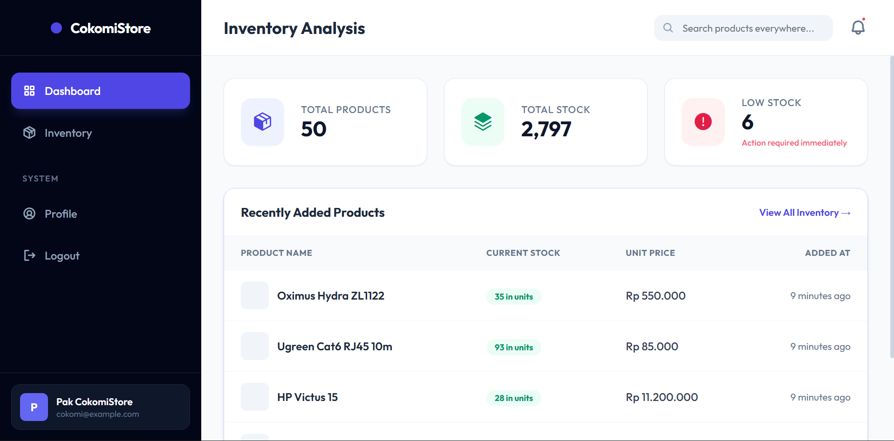
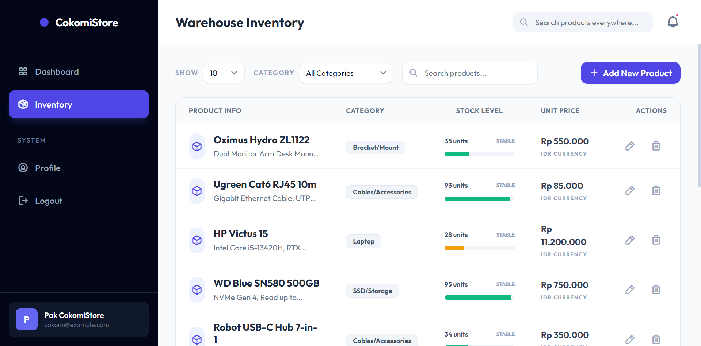
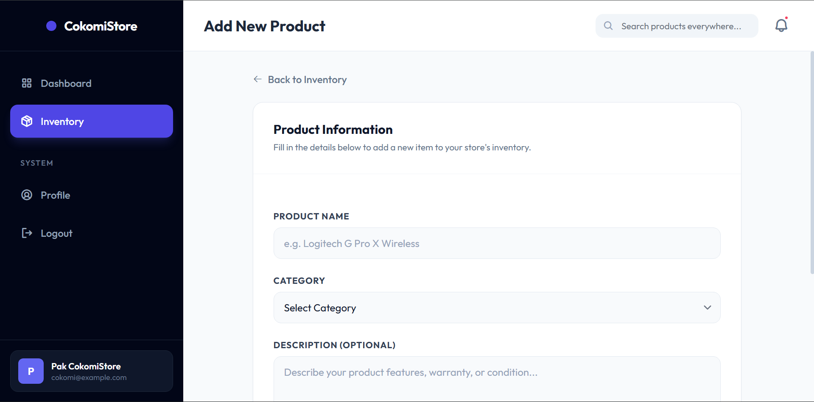
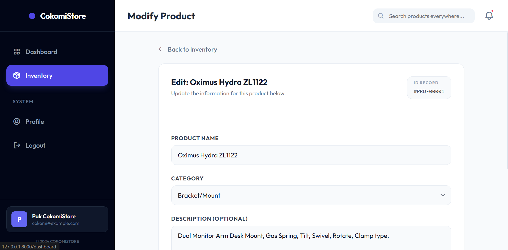
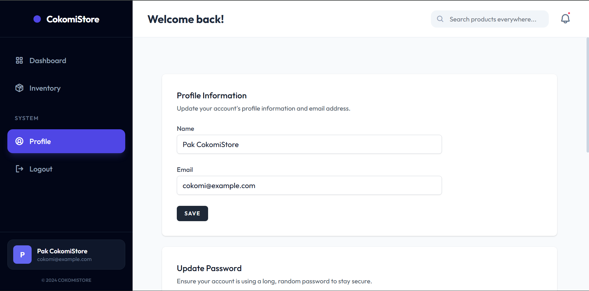
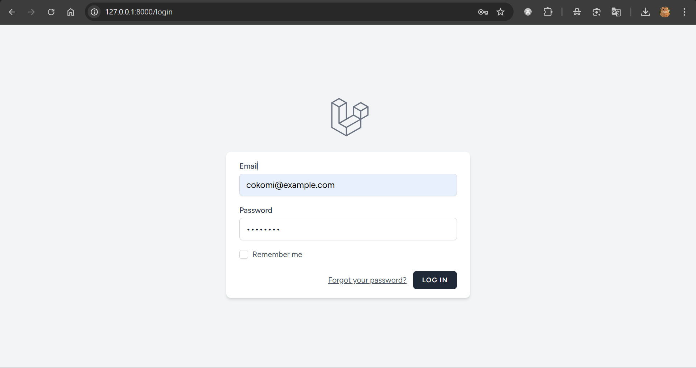
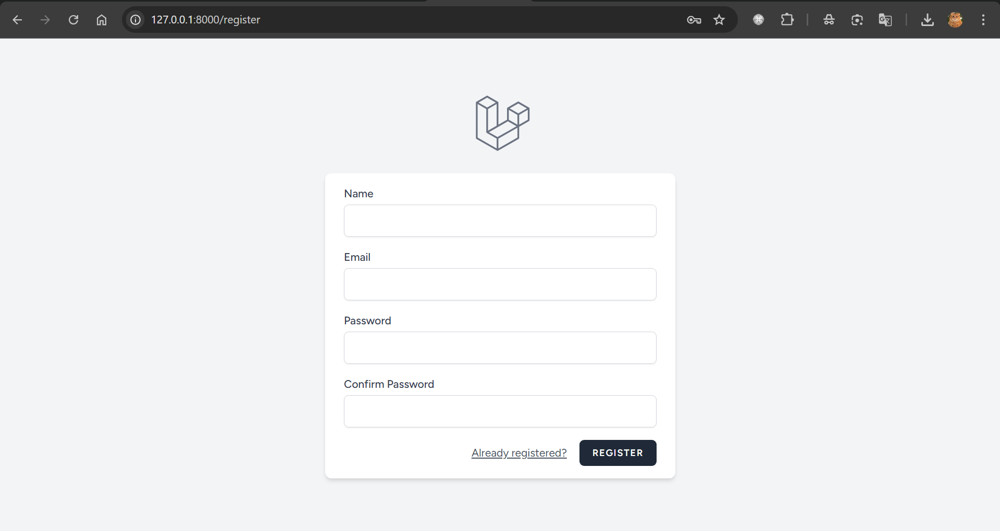

# 🖥️ WowoStore Inventory System

A professional, production-ready Inventory Management System specialized for **Computer Hardware Stores**. Built with **Laravel 12**, **Tailwind CSS**, and **Laravel Breeze**.

## ✨ Features
- **🔐 Secure Authentication**: Full auth flow powered by Laravel Breeze.
- **📊 Real-time Dashboard**: Overview of total products, total stock value, and **Low Stock Alerts** with visual indicators.
- **📦 Advanced Inventory CRUD**:
    - **Realistic Data**: Seeded with real computer hardware (Monitor, GPU, Laptop, etc.) with accurate specs and market prices.
    - **Grouping/Category**: Organized by hardware type for better management.
- **🔍 Smart Search & Filtering**:
    - **Global Search**: Search bar in Topbar connected to the product database.
    - **Advanced Filter**: Filter by Category and dynamic Pagination (10-100 entries).
- **🎨 Premium UI/UX**:
    - **Sidebar Layout**: Clean, fixed navigation with a professional Slate/Indigo theme.
    - **Glassmorphism**: Modern visual effects and custom typography (Outfit/Inter).
    - **Responsive Design**: Optimized for both Desktop and Mobile viewports.

## 🛠️ Tech Stack
- **Backend**: Laravel 12.x (PHP 8.2+)
- **Frontend**: Tailwind CSS + Alpine.js
- **Assets**: Vite
- **Icons**: Phosphor Icons (Custom CDN)
- **Database**: SQLite (Portable Storage)

## 🚀 Installation Steps

### 1. Requirements
- PHP 8.2+
- Composer
- Node.js & NPM

### 2. Setup Project
```powershell
# Navigate to the project directory
cd WowoStore

# Install Dependencies
composer install
npm install
```

### 3. Environment & Key
```powershell
cp .env.example .env
php artisan key:generate
```

### 4. Database Seeding
This will initialize the database with **50 realistic computer hardware items**.
```powershell
# Ensure DB exists
touch database/database.sqlite

# Migrate and Seed
php artisan migrate:fresh --seed --force
```

### 5. Start Application
```powershell
# Build Assets
npm run build

# Start Server
php artisan serve
```

## 🔐 Default Credentials
- **URL**: `http://localhost:8000/login`
- **Username**: `cokomi@example.com`
- **Password**: `Password`

## 🏭 Production-Style Structure
- **Models**: `Product` with fillable categories.
- **Controllers**: `ProductController` (Search & Filter) and `DashboardController`.
- **Requests**: `StoreProductRequest` and `UpdateProductRequest` for validation.
- **Components**: Reusable Blade & Alpine.js components (Modals, Buttons).

## 📸 Screenshots
Berikut adalah tampilan visual dari sistem **WowoStore**:

### 📊 Dashboard


### 📦 Inventory List


### ➕ Add Product


### ✏️ Edit Product


### 👤 User Profile


### 🔐 Login Page


### 📝 Register Page


---
© 2026 **WowoStore**. All rights reserved.
