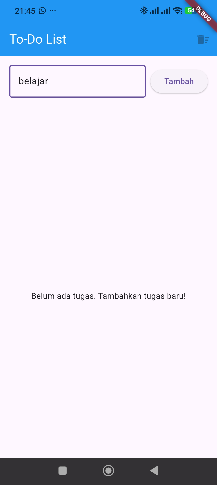
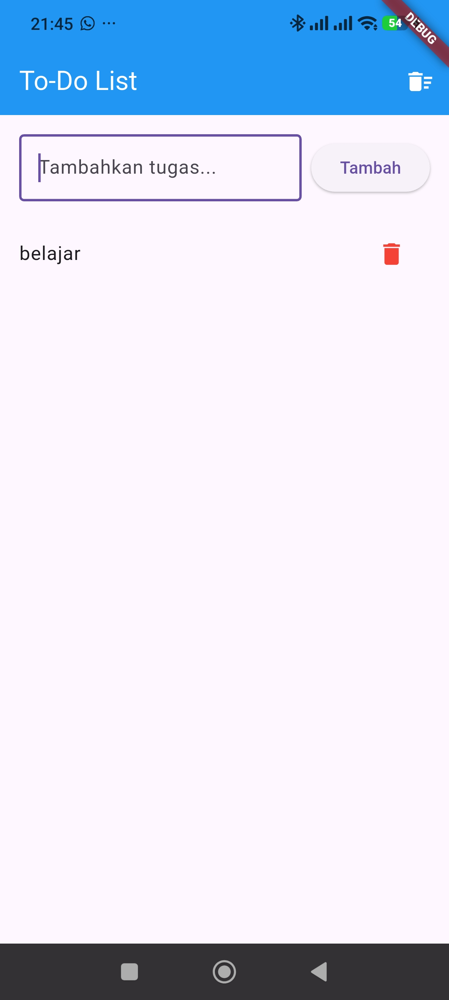

# Flutter To-Do App with FCM

Sebuah aplikasi To-Do List sederhana yang dibangun menggunakan Flutter, yang mengimplementasikan State Management dengan **Provider** dan Push Notification menggunakan **Firebase Cloud Messaging (FCM)**.

## Fitur Utama
1. **Manajemen Tugas (To-Do List)**: Menambahkan, menandai selesai, dan menghapus tugas.
2. **State Management**: Menggunakan `Provider` (`ChangeNotifier`) untuk mengelola state aplikasi secara efisien.
3. **Firebase Cloud Messaging (FCM)**: Terintegrasi dengan Firebase untuk menerima *Push Notification*.
4. **Local Notification**: Menampilkan notifikasi di *device* secara *foreground* maupun *background* menggunakan `flutter_local_notifications`.

## Struktur Kode
- `lib/models/todo_model.dart`: Berisi model data tugas dan `ChangeNotifier` untuk *State Management*.
- `lib/screens/home_screen.dart`: UI utama aplikasi yang menampilkan daftar tugas dan input untuk menambah tugas baru.
- `lib/services/notification_service.dart`: Berisi konfigurasi layanan untuk menangani notifikasi Firebase (FCM) dan pengaturan Local Notifications.
- `lib/main.dart`: *Entry point* aplikasi yang menginisialisasi Firebase, *Provider*, dan FCM *Background Handler*.

## Cara Menjalankan
1. Unduh *dependencies* proyek:
   ```bash
   flutter pub get
   ```
2. Jalankan aplikasi:
   ```bash
   flutter run
   ```

*(Catatan: Fitur Push Notification FCM lebih optimal dijalankan di Emulator Android atau Perangkat Asli daripada Web Browser).*

## Hasil Implementasi
Secara garis besar, aplikasi ini telah berhasil menjalankan dua fungsi inti:

1. **To-Do List dengan Provider**: 
   Aplikasi mampu melakukan penambahan tugas baru, mencentang tugas (selesai), dan menghapus daftar tugas. Seluruh perubahan data (*state*) dikelola secara terpusat oleh `Provider` (`ChangeNotifier`). Hal ini memastikan antarmuka (UI) diperbarui secara responsif dan efisien.

2. **Push Notification dengan FCM**: 
   Aplikasi berhasil terhubung dan mendapatkan token dari Firebase Cloud Messaging. Saat ada pesan pengumuman (*Push Notification*) yang dikirimkan dari Firebase Console:
   - Jika aplikasi sedang berada di *background* atau tertutup, notifikasi sistem Android akan otomatis muncul.
   - Jika aplikasi sedang aktif dibuka (*foreground*), aplikasi akan langsung menangkap pesan tersebut dan memunculkan *pop-up* peringatan secara lokal menggunakan bantuan *library* `flutter_local_notifications`.

## Tangkapan layar Aplikasi



